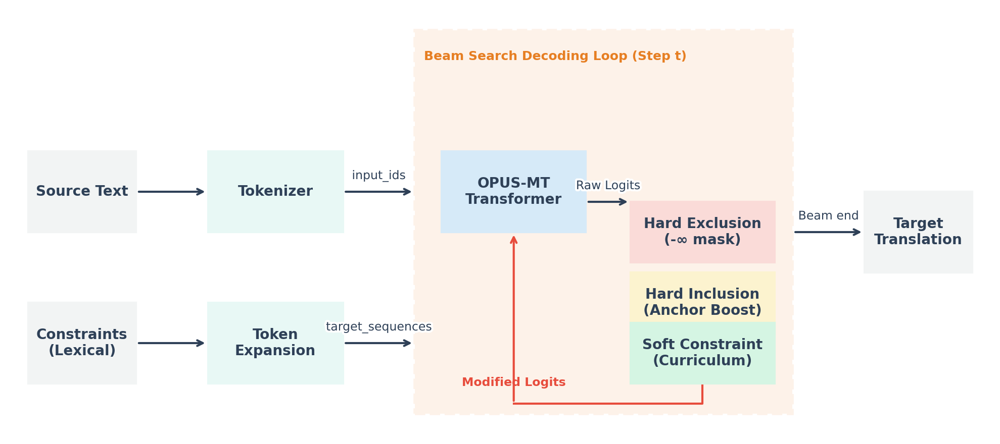
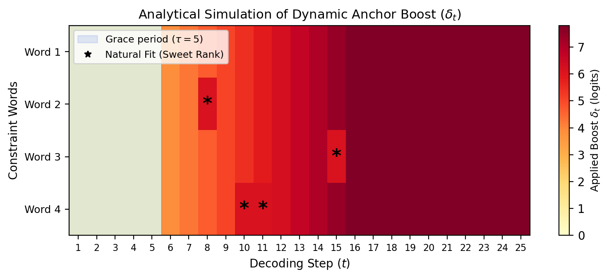
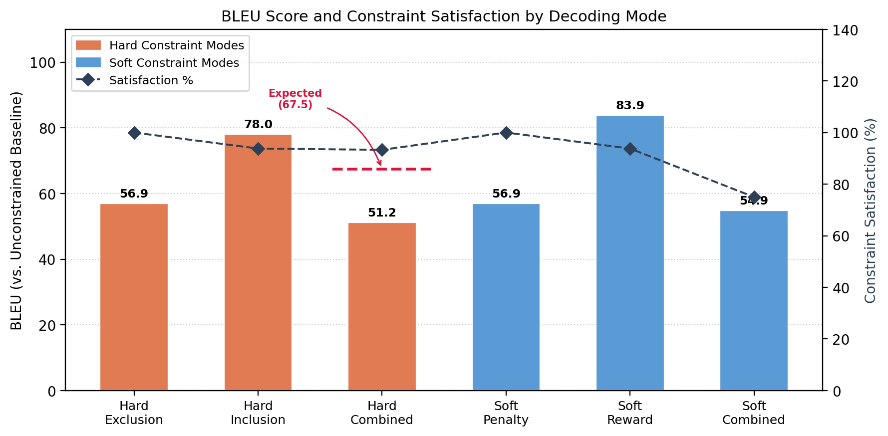
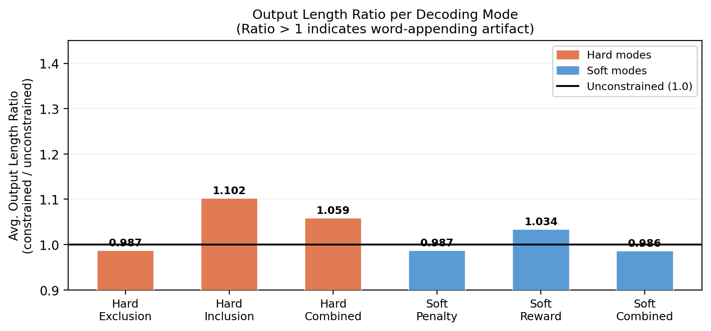
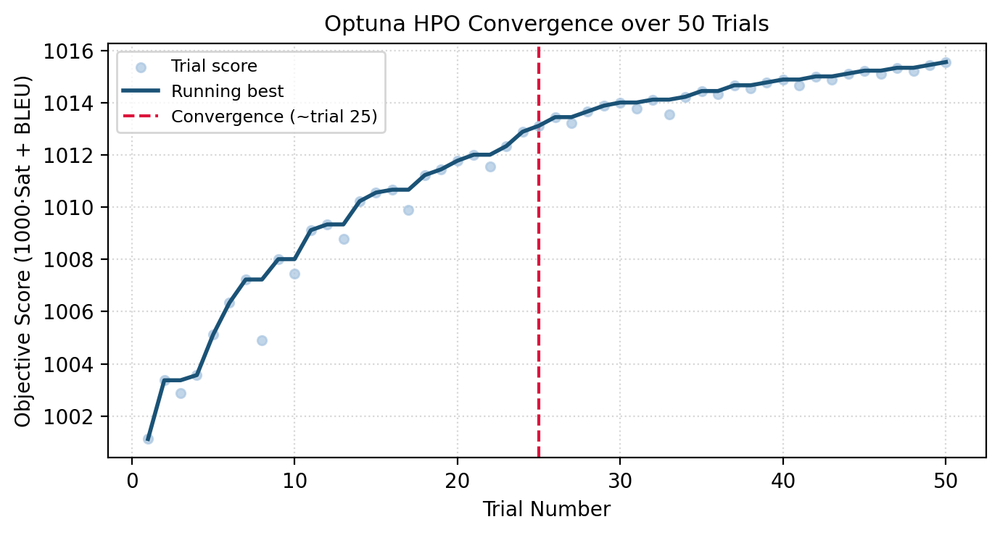

# Lexically Constrained and Interpretable Decoding for Neural Machine Translation

This repository contains the official implementation and experimental evaluation of logit-level lexical constraint enforcement for Neural Machine Translation (NMT), as presented in the paper **"Lexically Constrained and Interpretable Decoding for Neural Machine Translation"** by Alkım Gönenç Efe (İzmir Katip Çelebi University).

Instead of modifying model weights or restructuring beam search pipelines (e.g., Grid Beam Search or Dynamic Beam Allocation), this research investigates controlling NMT output by directly manipulating raw output logits at each decoding step. The proposed strategies are integrated directly into standard neural translation decoding pipelines, evaluated using Helsinki-NLP OPUS-MT models on English-to-Turkish (EN $\leftrightarrow$ TR) translation.

---

## Paper Abstract

Lexically constrained decoding allows users to inject domain-specific terminology into Neural Machine Translation (NMT) output at inference time, without retraining. While prior work has mostly followed structural approaches such as Grid Beam Search and Dynamic Beam Allocation, this paper takes a different route: adjusting raw output logits at each decoding step within a standard beam search pipeline. We implement and evaluate six strategies for English-to-Turkish and Turkish-to-English translation—hard exclusion, hard inclusion with dynamic anchor scheduling, soft penalty, curriculum-anchored reward, and two combined modes—using the Helsinki-NLP OPUS-MT models on a 60-sentence bilingual test set. 

Hard exclusion and soft penalty both achieve 100% constraint satisfaction with BLEU scores of 56.9 relative to an unconstrained baseline. Soft reward with escalation reaches 83.87 BLEU at 93.8% satisfaction. Hard inclusion achieves 78.0 BLEU at 93.8% satisfaction. When hard exclusion and inclusion run together, BLEU drops to 51.23 despite 93.3% satisfaction—a non-linear degradation we term the **logit squeeze effect**. We also report on challenges with subword tokenization, hyperparameter sensitivity, and exact-match enforcement in agglutinative Turkish.

---

## Key Contributions

1. **Logit-Level Decoding Control:** Direct manipulation of generation logits via standard API pipelines, bypassing the structural complexity and latency overheads of beam-level routing.
2. **Dynamic Anchor Scheduling:** A relative logit-anchoring mechanism that synchronizes constraint boosting with sequence generation progress to prevent early-token hallucinations.
3. **Escalation Ladder Framework:** A multi-tier fallback architecture that attempts the most fluent (softest) intervention first, only falling back to hard constraints as a last resort.
4. **Logit Squeeze Phenomenon:** Discovery and analysis of the non-linear translation quality degradation that occurs when competing inclusion and exclusion constraints are simultaneously enforced on the logit distribution.
5. **Turkish Morphological Mitigation:** Robust suffix expansion and morphological boundary penalties specifically designed to handle agglutinative morphology and BPE tokenization mismatches.

---

## Methodology

The architecture modifies raw output logits at each decoding step before candidate score updates.

The project implements three main logit-processing modules:

### 1. Hard Exclusion
This strategy masks the logits of forbidden tokens to $-\infty$, ensuring they are never sampled:

$$l_t^{(i)} = -\infty \quad \forall\, i \in \mathcal{F}$$

where $\mathcal{F}$ represents the set of forbidden token IDs and $l_t^{(i)}$ is the logit for token $i$ at step $t$.

### 2. Hard Inclusion with Dynamic Anchor Scheduling
To enforce required tokens without disrupting sequence coherence, this strategy avoids adding a constant boost (which disrupts target syntax and triggers word-appending artifacts) and instead uses a **dynamic anchor schedule**. For each pending required word, the applied boost $\delta_t$ at step $t$ is calculated dynamically relative to the maximum logit $l_t^{*}$ and the sentence completion ratio $\rho = t / (0.8 \cdot L_{\text{src}})$:

$$\delta_t = \begin{cases}
    0 & \text{if } t \leq \tau \quad \text{(grace period)} \\
    \beta_{\text{sweet}} & \text{if } r_t \leq R_{\text{sweet}} \quad \text{(natural fit)} \\
    \max(0,\; l_t^{*} + A_{\text{start}} + A_{\text{range}} \cdot \rho - l_t^{(w)}) & \text{otherwise}
\end{cases}$$

Here, $r_t$ is the natural rank of required token $w$ in the beam, $\tau$ is the initial token grace period, $R_{\text{sweet}}$ is the rank threshold where the word is considered a natural fit, $\beta_{\text{sweet}}$ is a small buffer, $A_{\text{start}}$ is the starting anchor offset, and $A_{\text{range}}$ is the anchoring climb rate. An end-of-sequence (EOS) blocking mechanism prevents premature termination when constraints remain unsatisfied.

### 3. Soft Constraints (Penalty & Curriculum Reward)
Soft constraints nudge the token probabilities without providing absolute guarantees, allowing natural vocabulary fallback.

*   **Soft Penalty:** Reduces the probability of undesired words without banning them outright:
    $$l_t^{(p)} \mathrel{+}= \lambda_{\text{pen}} \quad \forall\, p \in \mathcal{P}$$
*   **Soft Curriculum Reward:** Encourages required words using a curriculum baseline that scales with active steps $\eta$ to prevent early hallucinations:
    $$\lambda_{\text{eff}} = \min(\lambda_{\text{max}},\; \lambda_{\text{rew}} \cdot (1 + c \cdot \eta))$$
    If a target token's logit is below the baseline, it is pulled up to $l_t^* + \theta_{\text{offset}} + \lambda_{\text{eff}}$; otherwise, it receives a minor nudge.

### 4. Combined Modes & The Logit Squeeze Effect
*   **Hard Combined:** Concurrently runs hard exclusion and hard inclusion. Exclusion is processed first to ensure anchor calculations do not calibrate against masked $-\infty$ logits.
*   **Soft Combined:** Applies penalty and reward continuously in a single pass.

When inclusion and exclusion constraints compete, the logits are simultaneously masked from one side and boosted from another. This leads to a non-linear degradation of translation quality, designated as the **logit squeeze effect**.

---

## Experimental Setup

### Models & Datasets
*   **Models:** Helsinki-NLP `opus-mt-tc-big-en-tr` and `opus-mt-tc-big-tr-en` models.
*   **Dataset:** 60 bilingual sentence pairs split into a Hyperparameter Optimization (HPO) set and a held-out Evaluation set, representing domains such as medicine, technology, finance, and climate science.

### Evaluation Metrics
1.  **Constraint Satisfaction Rate ($S$):** The percentage of trials satisfying all inclusion/exclusion constraints (using a morphology-aware matcher).
2.  **BLEU Score:** Measured against the unconstrained baseline (representing fidelity to baseline generation; 100 indicates identical text).
3.  **Length Ratio:** Ratio of constrained output length to unconstrained baseline length (detects word-appending artifacts).

---

## Key Experimental Results

The aggregate metrics evaluated over the test sets are summarized below:

| Mode | Eval Count ($N$) | Satisfaction \% | BLEU | Length Ratio | Active Escalations |
| :--- | :---: | :---: | :---: | :---: | :---: |
| **Unconstrained Baseline** | — | — | 100.00 | 1.000 | — |
| **Hard Exclusion** | 60 | 100.0% | 56.90 | 0.987 | 0 |
| **Hard Inclusion** | 48 | 93.8% | 78.00 | 1.102 | 0 |
| **Hard Combined** | 60 | 93.3% | 51.23 | 1.059 | 0 |
| **Soft Penalty** | 60 | 100.0% | 56.90 | 0.987 | 0 |
| **Soft Reward (Escalation)**| 48 | 93.8% | 83.87 | 1.034 | 19 |
| **Soft Combined** | 60 | 75.0% | 54.87 | 0.986 | 18 |

---

## Analysis & Discussion

### The Logit Squeeze Effect
Simultaneous enforcement of inclusion and exclusion constraints in **Hard Combined** causes a non-linear quality degradation. While hard exclusion and hard inclusion in isolation achieve BLEU scores of 56.90 and 78.00, respectively, their combination drops the score to **51.23 BLEU**, falling significantly below the arithmetic mean of the two modes (67.45 BLEU).

### Output Length Ratios & Word-Appending
Structural inclusion constraints can trigger "word-appending" anomalies where required tokens are appended ungrammatically at the end of the sentence. The dynamic anchoring schedule reduces this length inflation from traditional static boosts, maintaining a stable length ratio of 1.10 for hard inclusion and 1.03 for soft reward.

### Agglutinative Turkish & Morphological Challenges
Turkish morphology presents a significant challenge for exact-match lexical constraints. Under BPE tokenization, root words are frequently split, causing mismatches when inflections (e.g., accusative, genitive suffixes) are attached to constrained words. 
*   **Suffix Expansion:** Required words are expanded to accept common inflected suffixes during scanning.
*   **Suffix Boundary Penalty:** A negative boundary penalty is applied to tokens immediately following constraint roots to prevent the model from inflecting them prematurely.

### Hyperparameter Optimization (HPO)
Using Optuna, the logit pressure settings were optimized using a lexicographic objective: $1000 \cdot S + \overline{\text{BLEU}}$, prioritizing satisfaction before translation similarity. The search converged rapidly within 10 iterations.

The optimal hyperparameters found include:
*   **Starting Anchor Offset ($A_{\text{start}}$):** $-16.54$
*   **Logit Range Climb ($A_{\text{range}}$):** $14.05$
*   **Curriculum Reward Base ($\lambda_{\text{rew}}$):** $3.75$
*   **Soft Exclusion Penalty ($\lambda_{\text{pen}}$):** $-34.93$
*   **Turkish Suffix Boundary Penalty ($\gamma_{\text{suffix}}$):** $-2.45$

---

## Conclusion
Logit-level manipulation provides a flexible, lightweight alternative to structural constrained decoding. Soft constraint scheduling paired with an escalation fallback framework yields the highest translation fidelity (83.87 BLEU) while maintaining high satisfaction (93.8%). Combining constraints highlights the logit squeeze effect, indicating that multi-constraint control does not scale linearly. Addressing agglutinative morphology via robust suffix boundaries is critical to performing constrained generation on languages like Turkish.