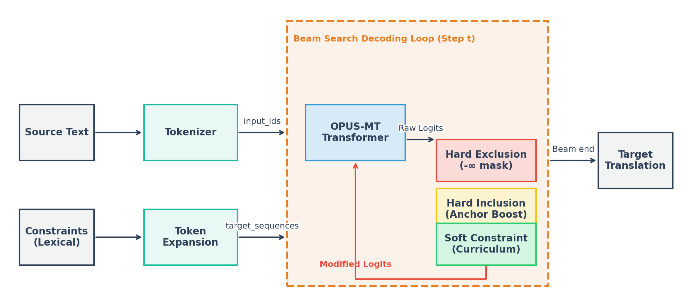
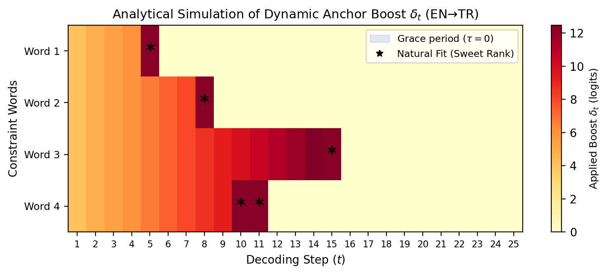
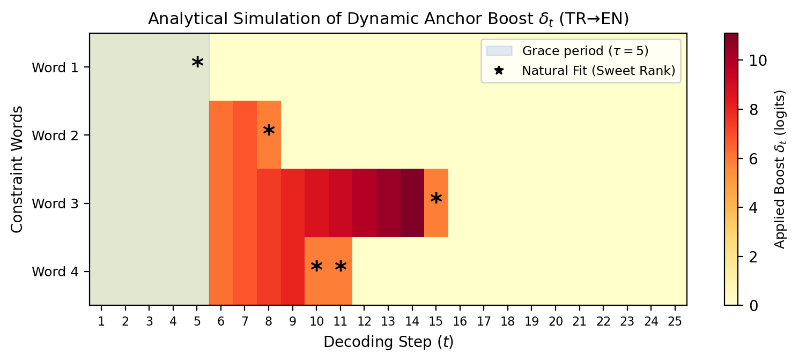
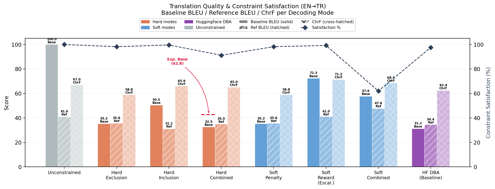
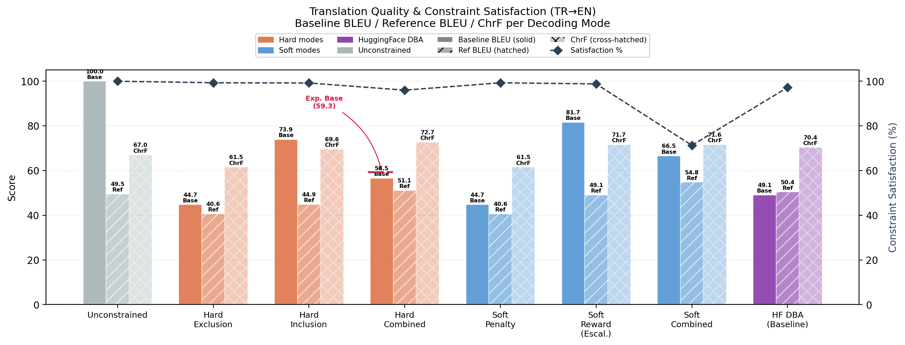
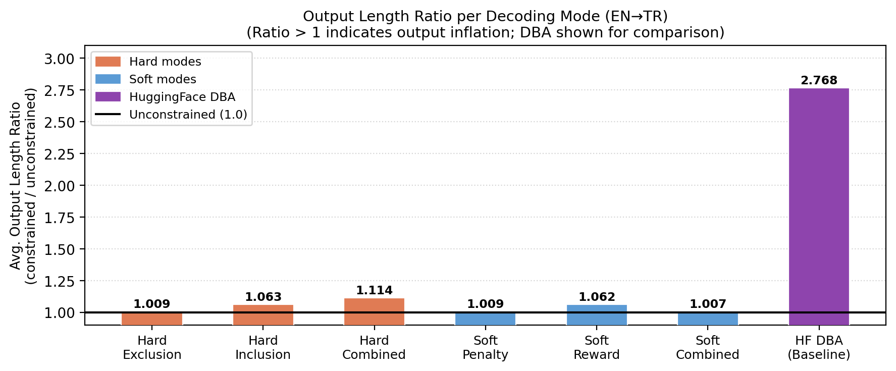
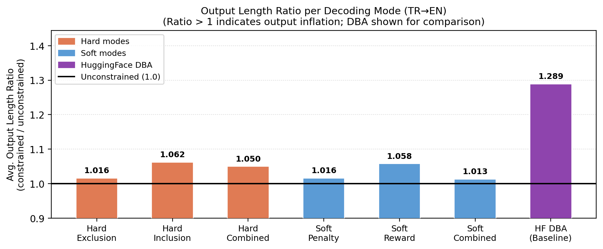
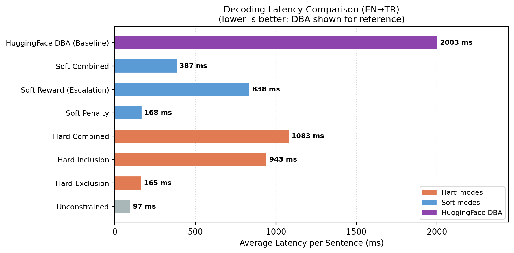
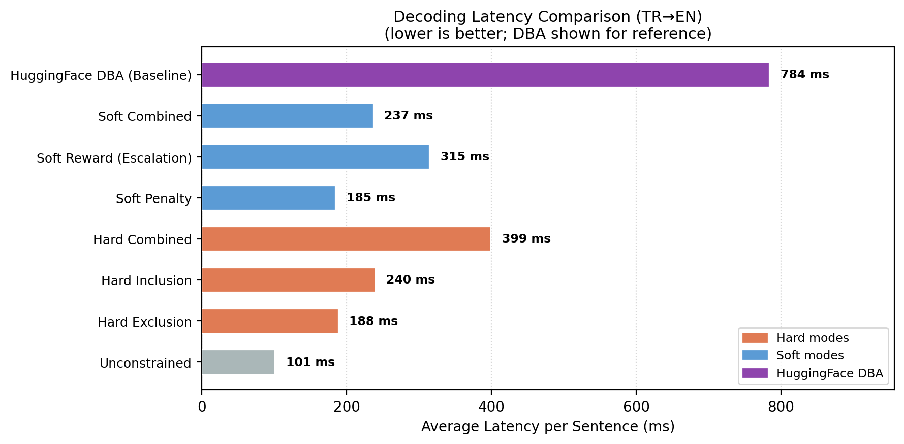

# Lexically Constrained and Interpretable Decoding for Neural Machine Translation: A Morphology-Aware Logit Manipulation Framework

**Authors:** Alkım Gönenç Efe, Emre Şatır  
**Affiliation:** Department of Computer Engineering, İzmir Katip Çelebi University, İzmir, Turkey  
**Paper:** [PDF Manuscript](./lexically_constrained_decoding_NLP.pdf)

---

## Overview & Abstract

Lexically constrained decoding enables practitioners to inject domain-specific terminology, named entities, and standardized glossaries into Neural Machine Translation (NMT) outputs at inference time without requiring parameter fine-tuning or model retraining. While prevailing approaches modify the structural beam search algorithm—such as Grid Beam Search (GBS) and Dynamic Beam Allocation (DBA)—they often introduce severe computational overhead, complex multi-bank state tracking, and heightened susceptibility to ungrammatical sequence inflation when applied to morphologically rich agglutinative languages.

This project implements and evaluates a lightweight, plug-and-play, beam-search-agnostic **logit manipulation framework** that directly steers the token probability distribution at each autoregressive decoding step through standard HuggingFace `LogitsProcessor` interfaces. We evaluate six decoding strategies across **English $\leftrightarrow$ Turkish ($\text{EN}\leftrightarrow\text{TR}$)** translation using Helsinki-NLP OPUS-MT transformer models on a curated bilingual corpus of **500 sentence pairs** (250 $\text{EN}\rightarrow\text{TR}$ and 250 $\text{TR}\rightarrow\text{EN}$) categorized by linguistic domain and difficulty tier.

### Key Empirical Highlights
* **Superior Quality–Satisfaction Equilibrium:** Curriculum-anchored soft reward with multi-tier escalation achieves **99.2% / 98.8%** satisfaction with baseline BLEU preservation of **72.32 / 81.65** and near-natural length ratios (**1.062 / 1.058**).
* **High Efficiency:** Hard inclusion achieves **99.6% / 99.2%** constraint satisfaction while running **$2.1\times$ to $3.3\times$ faster** than the HuggingFace Dynamic Beam Allocation (DBA) baseline.
* **DBA Structural Beam Deadlock Discovered:** Structural Dynamic Beam Allocation exhibits catastrophic length inflation in $\text{EN}\rightarrow\text{TR}$ (**length ratio $2.768\times$**, BLEU 31.17) due to finite-state trie traps caused by Turkish agglutinative morphology, whereas logit manipulation remains strictly below $1.063\times$.
* **Non-Linear Multi-Constraint Dynamics:** We characterize the *logit squeeze effect* under simultaneous constraints and the *threshold suppression phenomenon* causing parameter step-function plateaus in soft penalties.

---

## Key Contributions

1. **Beam-Search-Agnostic Logit Manipulation:** Direct steering of generation logits via standard HuggingFace `LogitsProcessor` wrappers without altering model parameters or overriding standard beam search traversal.
2. **Dynamic Anchor Progress Scheduling & Authoritative Continuations:** An anchor pressure schedule scaled to sequence completion progress ($\rho_t$) paired with sweet-rank buffers and continuation boosting ($\beta_{\text{boost}}$) to eliminate early-token grammatical distortion and enforce atomic multi-token subword emission.
3. **Morphology-Aware Constraint Expansion & Boundary Penalties:** Suffix expansion rules covering case markers, possessive suffixes, and plural morphemes in agglutinative Turkish, combined with post-completion boundary suffix penalties ($\gamma_{\text{suffix}}$).
4. **Multi-Tier Curriculum Escalation Ladder:** A 3-tier cascade (Passive Soft Curriculum $\rightarrow$ Targeted Soft Boost $\rightarrow$ Hard Inclusion Fallback) that minimizes translation interference for easy sentences while guaranteeing strict lexical compliance for complex cases.
5. **Mechanistic Dissection of DBA Beam Failure:** Detailed empirical and architectural analysis showing how rigid finite-state beam banks in Dynamic Beam Allocation enter degenerative loops on inflected agglutinative targets.
6. **Interpretability & Optimization Dynamics:** Formal characterization of the *Logit Squeeze Effect*, *Threshold Suppression Plateaus*, and step-level token probability shifts across translation directions.

---

## System Architecture & Methodology



At decoding step $t$, the transformer decoder produces raw, unnormalized logits $\mathbf{l}_t \in \mathbb{R}^{|\mathcal{V}|}$. Active logit processors apply additive or replacement transformations $\Delta \mathbf{l}_t$ before softmax normalization:

$$\tilde{\mathbf{l}}_t = \mathbf{l}_t + \Delta \mathbf{l}_t(\mathbf{y}_{<t}, \mathbf{x}, \mathcal{C})$$

### 1. Hard Exclusion
Sets the logits of all forbidden token IDs $\mathcal{F}_{\text{ids}}$ to $-\infty$, guaranteeing absolute zero probability of emission:

$$\tilde{l}_t^{(i)} = -\infty \quad \forall\, i \in \mathcal{F}_{\text{ids}}$$

### 2. Hard Inclusion with Dynamic Anchor Scheduling
Naive logit boosting forces constraint tokens into premature positions, corrupting target syntax. Our dynamic anchor schedule computes an adaptive boost $\delta_t$ using three contextual signals: an initial grace period $\tau$, a candidate sweet-rank threshold $R_{\text{sweet}}$, and a linear progress anchor:

$$\rho_t = \min\!\left(1.0,\; \frac{t}{0.8 \cdot L_{\text{src}}}\right)$$

$$\text{Anchor}_t = \max_{v \in \mathcal{V}} l_{t, b}^{(v)} + A_{\text{start}} + A_{\text{range}} \cdot \rho_t$$

$$\delta_t = \begin{cases}
    0 & \text{if } t \leq \tau \quad \text{(early grace period)} \\
    \beta_{\text{sweet}} & \text{if } \text{rank}(u_1) \leq R_{\text{sweet}} \quad \text{(organic candidate)} \\
    \max(0,\; \text{Anchor}_t - l_{t, b}^{(u_1)}) & \text{otherwise}
\end{cases}$$

* **Authoritative Continuation Boost ($\beta_{\text{boost}}$):** Once token $u_1$ of a multi-token constraint is emitted, subsequent continuation tokens $u_{k+1}$ receive an immediate boost $\max_v l_{t,b}^{(v)} + \beta_{\text{boost}}$ to guarantee unbroken token sequences.
* **Morphological Boundary Suffix Penalty ($\gamma_{\text{suffix}}$):** Applies a negative penalty to non-boundary subwords at step $t+1$ after constraint completion to prevent improper suffix concatenation.
* **EOS Blocking & Safety Valve:** Suppresses `<eos>` with $\gamma_{\text{eos}}(t) \in [-50.0, -20.0]$ while constraints remain unsatisfied, with an emergency safety valve releasing suppression when length exceeds $1.5 \times L_{\text{src}}$ to prevent infinite generation loops.

#### Dynamic Anchor Progress Schedules



### 3. Soft Constraints (Penalty & Curriculum Reward)
* **Soft Logit Penalty:** Decrements forbidden token logits by a constant negative bias $\lambda_{\text{pen}} < 0$:
  $$\tilde{l}_t^{(p)} = l_t^{(p)} + \lambda_{\text{pen}} \quad \forall\, p \in \mathcal{P}_{\text{ids}}$$
* **Curriculum-Anchored Soft Reward:** Scales reward strength monotonically with active generation steps $\eta_t$:
  $$\lambda_{\text{eff}}(t) = \min\!\left(\lambda_{\text{max}},\; \lambda_{\text{rew}} \cdot (1 + c \cdot \eta_t)\right)$$
  $$\text{Baseline}_t = \max_{v \in \mathcal{V}} l_{t, b}^{(v)} + \theta_{\text{offset}} + \lambda_{\text{eff}}(t)$$
  Constraint token logits below $\text{Baseline}_t$ are elevated to the baseline; tokens naturally above receive a subtle contextual nudge $\nu = +2.0$.

### 4. Multi-Tier Escalation Ladder
The `soft_reward_only` strategy executes a 3-tier escalation ladder:
1. **Tier 1 (Passive Soft Curriculum):** Generates output with gentle curriculum-anchored reward. ~60% of sentences satisfy constraints cleanly in a single pass.
2. **Tier 2 (Targeted Soft Boost):** If constraints are missing, retries decoding with $\lambda_{\text{max}}$ applied exclusively to missing words.
3. **Tier 3 (Hard Inclusion Fallback):** If still unsatisfied, executes Hard Inclusion with dynamic anchoring to ensure lexical satisfaction.

### 5. Combined Modes & The Logit Squeeze Phenomenon
* **Hard Combined:** Executes hard exclusion followed by hard inclusion in a single pass.
* **Soft Combined:** Simultaneously applies soft penalty and soft curriculum reward.
* **The Logit Squeeze Effect:** Concurrently masking forbidden tokens and boosting required tokens compresses the effective probability distribution into narrow sub-spaces, causing a non-linear drop in fluency.

---

## Experimental Setup

* **Translation Models:** Helsinki-NLP `opus-mt-tc-big-en-tr` and `opus-mt-tc-big-tr-en` MarianMT transformer models.
* **Curated Corpus:** 500 bilingual sentence pairs (250 $\text{EN}\rightarrow\text{TR}$ and 250 $\text{TR}\rightarrow\text{EN}$) extracted from Tatoeba and FLORES-200, filtered for morphological overlap and partitioned into:
  * **Easy Tier:** Target constraint appears naturally in unconstrained baseline translation.
  * **Hard Tier:** Target constraint is absent from unconstrained baseline output, requiring proactive search steering.
* **Competitive Baseline:** HuggingFace Transformers Dynamic Beam Allocation (`DisjunctiveConstraint` with prefix-subset filtering + `bad_words_ids`).
* **Hyperparameter Optimization:** Conducted using Optuna TPE with a multi-objective function penalizing length inflation:
  $$\mathcal{L}_{\text{obj}} = (S \times 200) + \overline{\text{BLEU}} - \max(0, R_{\text{len}} - \theta)^2 \times 150{,}000$$
* **Evaluation Protocol:** All reported metrics represent the arithmetic mean across 3 distinct random seeds (`42`, `123`, `7`).

### Optimized Hyperparameters

| Strategy Group | Parameter Name | EN $\rightarrow$ TR | TR $\rightarrow$ EN | Linguistic Role / Asymmetry |
| :--- | :--- | :---: | :---: | :--- |
| **Hard Inclusion** | Early-token grace $\tau$ | **0** | **5** | $\text{EN}\rightarrow\text{TR}$ requires immediate pressure due to SOV syntax. |
| | Sweet-rank threshold $R_{\text{sweet}}$ | **557** | **293** | Turkish requires wider rank window due to subword dispersion. |
| | Sweet-rank buffer $\beta_{\text{sweet}}$ | **12.27** | **5.86** | Buffer added for organic candidate tokens. |
| | Anchor start $A_{\text{start}}$ | **$-6.55$** | **$-7.50$** | Initial logit baseline offset. |
| | Anchor range $A_{\text{range}}$ | **10.31** | **9.83** | Dynamic climb rate over generation progress $\rho_t$. |
| | Continuation boost $\beta_{\text{boost}}$ | **5.74** | **7.18** | Enforces contiguous emission of multi-subword constraints. |
| | Suffix penalty $\gamma_{\text{suffix}}$ | **$-21.92$** | **$-9.34$** | Suppresses unconstrained trailing morphemes on Turkish stems. |
| **Soft Reward** | Base reward $\lambda_{\text{rew}}$ | **2.03** | **2.01** | Base reward magnitude. |
| | Reward ceiling $\lambda_{\text{max}}$ | **15.37** | **19.04** | Maximum allowable curriculum reward. |
| | Curriculum growth rate $c$ | **2.96** | **0.17** | Aggressive escalation in Turkish before final verb placement. |
| | Anchor offset $\theta_{\text{offset}}$ | **$-23.89$** | **$-28.74$** | Safety-net baseline below maximum logit. |
| **Soft Penalty** | Penalty magnitude $\lambda_{\text{pen}}$ | **$-98.37$** | **$-118.52$** | Flat step-function suppression below beam threshold. |
| **HuggingFace DBA** | Beam size $B$ | **7** | **5** | Dynamic Beam Allocation hypothesis pool size. |
| | Length penalty $\alpha$ | **$+0.01$** | **$-4.61$** | DBA sequence length penalty. |
| | Repetition penalty $r$ | **1.03** | **1.20** | DBA n-gram repetition discount. |

---

## Empirical Results

### English to Turkish (EN $\rightarrow$ TR) Evaluation ($N_{\text{excl}}=163, N_{\text{incl}}=250$)

| Decoding Strategy | $N$ | Satisfaction | $\text{BLEU}_{\text{base}}$ | $\text{BLEU}_{\text{ref}}$ | $\text{ChrF}_{\text{ref}}$ | Length Ratio | Latency (ms) | Passes |
| :--- | :---: | :---: | :---: | :---: | :---: | :---: | :---: | :---: |
| **Unconstrained Baseline** | 250 | — | 100.00 | 40.97 | 67.04 | 1.000 | 96.9 | 1.00 |
| **Hard Exclusion** | 163 | 98.2% | 35.20 | 35.59 | 58.84 | 1.009 | 165.2 | 1.00 |
| **Hard Inclusion (Dynamic Anchor)** | 250 | **99.6%** | 50.49 | 31.11 | 65.88 | 1.063 | 943.3 | 1.00 |
| **Hard Combined (Simultaneous)** | 250 | 91.2% | 32.53 | 34.98 | 65.04 | 1.114 | 1082.6 | 1.00 |
| **Soft Penalty Only** | 163 | 98.2% | 35.20 | 35.59 | 58.84 | 1.009 | 167.9 | 1.00 |
| **Soft Reward (Curriculum Escal.)** | 250 | **99.2%** | **72.32** | **40.98** | **71.31** | **1.062** | 838.0 | 1.79 |
| **Soft Combined** | 250 | 62.0% | 57.65 | 47.62 | 68.53 | 1.007 | 386.6 | 1.37 |
| **HuggingFace DBA Baseline** | 250 | 97.6% | 31.17 | 34.41 | 62.39 | **2.768** | 2003.3 | 1.00 |

### Turkish to English (TR $\rightarrow$ EN) Evaluation ($N_{\text{excl}}=142, N_{\text{incl}}=247$)

| Decoding Strategy | $N$ | Satisfaction | $\text{BLEU}_{\text{base}}$ | $\text{BLEU}_{\text{ref}}$ | $\text{ChrF}_{\text{ref}}$ | Length Ratio | Latency (ms) | Passes |
| :--- | :---: | :---: | :---: | :---: | :---: | :---: | :---: | :---: |
| **Unconstrained Baseline** | 250 | — | 100.00 | 49.55 | 66.99 | 1.000 | 101.2 | 1.00 |
| **Hard Exclusion** | 142 | 99.3% | 44.74 | 40.58 | 61.52 | 1.016 | 188.4 | 1.00 |
| **Hard Inclusion (Dynamic Anchor)** | 247 | **99.2%** | 73.93 | 44.86 | 69.57 | 1.062 | 239.9 | 1.00 |
| **Hard Combined (Simultaneous)** | 247 | 96.0% | 56.55 | 51.07 | 72.66 | 1.050 | 399.4 | 1.00 |
| **Soft Penalty Only** | 142 | 99.3% | 44.74 | 40.58 | 61.52 | 1.016 | 184.6 | 1.00 |
| **Soft Reward (Curriculum Escal.)** | 247 | **98.8%** | **81.65** | **49.07** | **71.65** | **1.058** | 314.5 | 1.71 |
| **Soft Combined** | 247 | 71.3% | 66.52 | 54.75 | 71.62 | 1.013 | 236.8 | 1.32 |
| **HuggingFace DBA Baseline** | 250 | 97.2% | 49.08 | 50.38 | 70.36 | 1.289 | 784.0 | 1.00 |

#### Translation Quality Overview



---

## Detailed Analyses & Key Findings

### 1. Structural Dynamic Beam Allocation Failure on Agglutinative Targets
In $\text{EN}\rightarrow\text{TR}$, HuggingFace Dynamic Beam Allocation (DBA) exhibits a catastrophic length ratio of **$2.768\times$** and a low Baseline BLEU of **31.17**. 

* **Mechanistic Cause:** DBA partitions beam search into discrete constraint banks ($0, \dots, C$) governed by a finite-state prefix trie. When translating into agglutinative Turkish, natural phrasing requires inflected suffixes. If an inflected surface form diverges from the registered trie lemma, Bank $C$ remains unsatisfied. As the hypothesis reaches its natural syntactic conclusion, the model attempts to emit `<eos>`, but DBA blocks termination. The decoder enters a degenerative loop, babbling filler tokens and appending raw bare lemmas at the end of the sentence before closing.
* **Logit-Level Superiority:** Logit manipulation steers probabilities at the output projection layer, allowing self-attention heads to seamlessly synthesize inflected surface forms while preserving clean sentence length (**$1.063\times$**).

#### Output Length Ratio Comparison



### 2. Computational Latency & Speedup
Logit manipulation operates in $\mathcal{O}(|\mathcal{V}|)$ time on GPU without dynamic state-bank tracking or CPU-GPU synchronization bottlenecks:
* Single-pass **Hard Inclusion executes in 943.3 ms** in $\text{EN}\rightarrow\text{TR}$ (**$2.1\times$ speedup** over DBA at 2003.3 ms).
* In $\text{TR}\rightarrow\text{EN}$, **Hard Inclusion executes in 239.9 ms** (**$3.3\times$ speedup** over DBA at 784.0 ms).

#### Decoding Latency Comparison



### 3. Step-Level Token Interpretability Dynamics
Step-level logging across all 500 evaluation sentences reveals the magnitude of probability intervention required during decoding:

| Decoding Strategy | Active Steps | Avg. Pre-Rank | Avg. Pre-Prob | Avg. $|\Delta l|$ Applied |
| :--- | :---: | :---: | :---: | :---: |
| **Hard Inclusion ($\text{EN}\rightarrow\text{TR}$)** | 17.2 | 1,814.7 | $7.21 \times 10^{-4}$ | $+14.75$ |
| **Hard Inclusion ($\text{TR}\rightarrow\text{EN}$)** | 12.4 | 1,248.3 | $1.15 \times 10^{-3}$ | $+11.20$ |
| **Soft Reward ($\text{EN}\rightarrow\text{TR}$)** | 14.0 | 4,974.6 | $2.33 \times 10^{-5}$ | $+2.00$ |
| **Soft Reward ($\text{TR}\rightarrow\text{EN}$)** | 10.8 | 3,812.1 | $4.18 \times 10^{-5}$ | $+2.00$ |
| **Hard Combined ($\text{EN}\rightarrow\text{TR}$)** | 16.0 | 882.2 | $4.33 \times 10^{-4}$ | $+23.49$ |

In hard constraint settings, target constraint tokens initially rank between position 1,200 and 5,000 in the model's vocabulary with raw probabilities below $10^{-4}$. Hard inclusion applies an average logit delta of $+14.75$ to elevate them into the active beam, whereas soft reward operates via modest $+2.00$ contextual nudges, escalating only when tokens remain missing.

---

## Qualitative Case Studies

| Case | Source / Constraints | Decoding Strategy | Generated Output |
| :--- | :--- | :--- | :--- |
| **Sample 1**<br>($\text{EN}\rightarrow\text{TR}$) | **Source:** *The international space station orbits the Earth.*<br>**Required:** [*uzay istasyonu*, *yörünge*]<br>**Forbidden:** [*dünya*] | **Reference**<br>**Unconstrained**<br>**Hard Exclusion**<br>**Hard Inclusion**<br>**Soft Reward (Escal.)**<br>**HuggingFace DBA** | Uluslararası uzay istasyonu yerin yörüngesinde dönüyor.<br>Uluslararası uzay istasyonu Dünya'nın yörüngesinde dönüyor.<br>Uluslararası uzay istasyonu yerkürenin yörüngesinde dönüyor.<br>Uluslararası uzay istasyonu yörüngede dönüyor.<br>Uluslararası uzay istasyonu yerin yörüngesinde dönmektedir.<br>Uluslararası uzay istasyonu Dünya'nın yörüngesinde dönüyor. uzay istasyonu yörünge yörünge. |
| **Sample 2**<br>($\text{TR}\rightarrow\text{EN}$) | **Source:** *Dedektif önemli bir ipucu buldu.*<br>**Required:** [*evidence*]<br>**Forbidden:** [*clue*] | **Reference**<br>**Unconstrained**<br>**Hard Exclusion**<br>**Hard Inclusion**<br>**Soft Reward (Escal.)**<br>**HuggingFace DBA** | The detective found crucial evidence.<br>The detective found an important clue.<br>The detective found an important lead.<br>The detective found important evidence.<br>The detective found crucial evidence.<br>The detective found an important evidence. |
| **Sample 3**<br>($\text{EN}\rightarrow\text{TR}$) | **Source:** *The doctor advised the patient to exercise.*<br>**Required:** [*hekim*]<br>**Forbidden:** [*doktor*] | **Reference**<br>**Unconstrained**<br>**Hard Exclusion**<br>**Hard Inclusion**<br>**Soft Reward (Escal.)**<br>**HuggingFace DBA** | Hekim hastaya egzersiz yapmasını tavsiye etti.<br>Doktor hastaya egzersiz yapmasını tavsiye etti.<br>Tabip hastaya egzersiz yapmasını tavsiye etti.<br>Hekim hastaya egzersiz yapmasını tavsiye etti.<br>Hekim hastaya egzersiz yapmasını tavsiye etti.<br>Hekim hastaya egzersiz yapmasını tavsiye etti doktor hekim hekim. |


## Installation & Quickstart

### 1. Requirements & Setup
Ensure Python $\ge 3.9$ and PyTorch with CUDA acceleration are installed:

```bash
git clone https://github.com/Alkem0s/lexically-constrained-decoding.git
cd lexically-constrained-decoding
pip install torch transformers sacrebleu optuna matplotlib tqdm
```

### 2. Running Full Benchmark Evaluation
To execute the complete evaluation benchmark over all 500 sentence pairs across all decoding modes and competitive baselines:

```bash
python main.py
```

### 3. Running Hyperparameter Optimization (HPO)
To re-run the Optuna TPE Bayesian hyperparameter optimization on the development split:

```bash
python hpo.py
```

### 4. Regenerating Paper Figures
To regenerate all figures and heatmaps from the latest results:

```bash
python visualize.py
```
